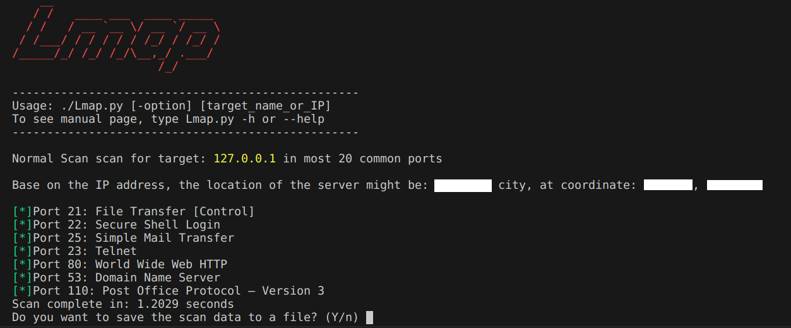
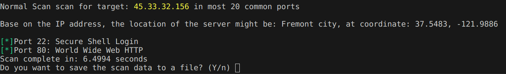
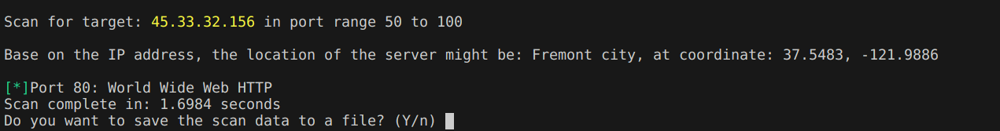
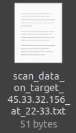

## Intro
 I created a simple port scanner named **Lmap**, inspired by famous tool Nmap. Utilizing the ```socket``` library in Python, I crafted this project in just a few days during my vacation. Here's a quick look:



## Main Features
- **h** option: Prints the help menu.
- **n** option: Performs a normal scan, checking the 20 most popular ports defined in myList.
```python
mylist = [21, 22, 23, 25, 53, 80, 110, 111, 135, 139, 143, 443, 445, 993, 995, 1723, 3306, 3389, 5900, 8080]
```
Example: ```./Lmap -n scanme.org```

- **r** option: Allows users to specify a port range to scan.
Example: ```./Lmap.py -r 50-100 scanme.org```

- Save scan data to a text file with a filename based on the target and the time the scan was taken.



Before running ./Lmap.py, make sure the main code file has permission to execute by:
```bash
 chmod +x LmapBeta.py
```
### Note
You can use http://scanme.org/ as a practice target, a website provided by Nmap for experimentation. Avoid performing port scans on arbitrary servers, as this action may be considered illegal in some countries. Otherwhile, for experimental purposes in this project, I've created ```server.py``` that listens for requests on specified ports we can set.
```python
import socket
import threading

def start_server(port):
    server_socket = socket.socket(socket.AF_INET, socket.SOCK_STREAM)
    server_socket.bind(('localhost', port))
    server_socket.listen(1)

    print(f"Server listening on port {port}")

    while True:
        client_socket, client_address = server_socket.accept()
        print(f"Connection from {client_address}")
        client_socket.send(b"Welcome to the server!")
        client_socket.close()

if __name__ == "__main__":
    ports = [21, 22, 23, 25, 53, 80, 110,]  # Add more ports as needed

    threads = []

    for port in ports:
        thread = threading.Thread(target=start_server, args=(port,))
        threads.append(thread)
        thread.start()

    for thread in threads:
        thread.join()
```

Run the server with: 
```bash
sudo python3 server.py
```
And it will listen on the set ports, receiving incoming requests.
```plaintext
Server listening on port 23
Server listening on port 22
Server listening on port 21
Server listening on port 53
Server listening on port 25
Server listening on port 80
Server listening on port 110
Connection from ('127.0.0.1', 36938)
Connection from ('127.0.0.1', 49454)
Connection from ('127.0.0.1', 41208)
Connection from ('127.0.0.1', 33612)
Connection from ('127.0.0.1', 51322)
Connection from ('127.0.0.1', 54824)
Connection from ('127.0.0.1', 60342)
```

## Details how it work
To begin with, the program reads parameters from the command line, for example: `./Lmap.py -n localhost`. We extract the value for the `options` from the input using `sys.argv`:

```python
options = sys.argv[1] if len(sys.argv) > 1 else None
```
Based on the chosen option, the main program calls relevant functions. In the example, the normal scan mode is used.

In this mode, the initial step is to read the target parameter. The target should ideally be an IP address. Therefore, I check whether it is an IP address. If it is still a name, I convert it back to an IP using ```socket.gethostbyname()```:

```python
#the last argument in the command line is the target
target = sys.argv[-1] if len(sys.argv) > 2 else None
target = check_target(target)
```

Once we have the target IP, we can initiate the scan process by calling the ```normal_scan``` function. This function takes the target IP as a parameter and performs the following tasks:

- Determine the server location based on that IP address. Here, I use the geocoder library:
```python
def print_location(target):
    # When working with localhost, the geocoder library only returns results if I use the target IP as 'me' instead of '127.0.0.1'
    if target == '127.0.0.1':
        target = 'me'

    if geocoder.ip(target).city is not None:
        print('Based on the IP address, the location of the server might be: ' + str(geocoder.ip(target).city) + ' city, at coordinates: ' + str(geocoder.ip(target).latlng[0]) + ', ' + str(geocoder.ip(target).latlng[1]) + '\n')
```
**Note**: I've observed that the geocoder library takes a considerable amount of time to process, potentially slowing down the program. Additionally, its accuracy may vary. In my location, the coordinate deviation is approximately 3-4 km. Hence, you may want to comment out this feature if it's not particularly useful for you.

- Based on the provided ports, attempt to connect to each of them:
```python
def check_port_is_open(target, port):
    # Create a socket object
    s = socket.socket(socket.AF_INET, socket.SOCK_STREAM) 
    # AF_INET: Address Family, IPv4
    # SOCK_STREAM: TCP protocol
    s.settimeout(1) # Set timeout to 1 second

    # Connect to the port
    result = s.connect_ex((target, port))
    if result == 0:
        print(GREEN + "[*]" + RESET + 'Port ' + str(port) + ': ' + str(lookup_port_name(port)))
    # else:
    #     print(RED + "[*]" + RESET + 'Port', port, ':', lookup_port_name(port))
    s.close()
```
I use a socket to establish a connection to each port, specifying the parameters for the TCP three-way handshake connection. Based on the returned result, we determine the state of the port. 

- Once we identify an open port, we look up the port number in ```portlist.csv``` to find the corresponding name or service.


However, if we use a for loop to sequentially scan each port, it could significantly slow down the scanning process. Therefore, I employ multi-threading from the ```thread``` library to scan ports simultaneously.
```python
threads = []
    for port in mylist:
        thread = threading.Thread(target=check_port_is_open, args=(target, port))
        thread.start()
        threads.append(thread)
    for thread in threads:
        thread.join()
```
To create a new thread, we create an object of the Thread class. It takes the **‘target’** and **‘args’** as the parameters. The target is the function to be executed by the thread whereas the args is the arguments to be passed to the target function as I did in this line: ```thread = threading.Thread(target=check_port_is_open, args=(target, port))``` 
 We wait for all ports to be scanned completely before moving on to the next part using the ```.join()``` method.

## Reference:
I find this website explain quite comprehensive about socket in Python:

 https://www.datacamp.com/tutorial/a-complete-guide-to-socket-programming-in-python

and some usefull tutorial videos on Youtube:
1. https://m.youtube.com/watch?v=DmrZyNiE6M
2. https://m.youtube.com/watch?v=XGFDXGyd7Uw
3. https://youtu.be/vRhPOE2uTGA?si=r97YYCAOd_64G1mV


